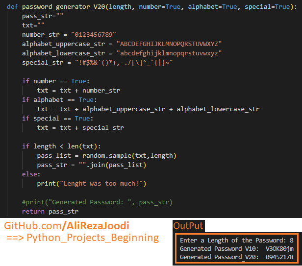

It's my solutions for **Password Generator**.

### Assignment
Write a program to create a password that including of numbers, uppercase, lowercase and special characters.

### Development
Write your code in `Password_Generator.py`. For development, you can use `Main.py` to test your function. Click the "Run" button and main.py will run.

Thanks to: [Aman Kharwal](https://thecleverprogrammer.com/about)  
Source Link:  [Python Program to Generate Password](https://thecleverprogrammer.com/2021/01/11/python-program-to-generate-password)

**Note**: [You can go here to download a single folder or file from GitHub.com](https://minhaskamal.github.io/DownGit/#/home)
